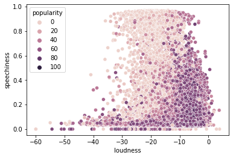
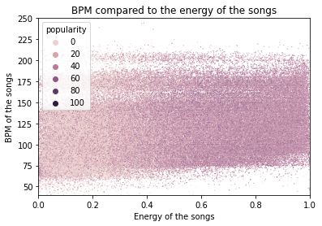
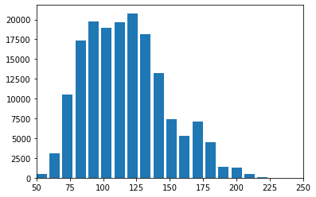
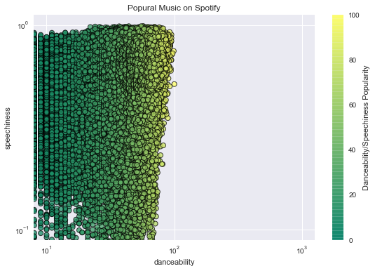
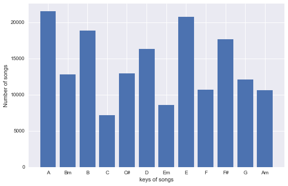

In this challenge Maurice Magorane and Lucas Kustermans visualize some interesting datapoints from a dataset that we found on Kaggle.com.
	- This is the dataset we took: https://www.kaggle.com/yamaerenay/spotify-dataset-19212020-160k-tracks?select=data.csv
    
## Plot 1: Popularity vs speechiness and loudness.
We wanted to know what makes a Song Likeable? Analyzing Spotify's  popular song and see if people like songs which are speechless or loudness. 
This Graph show that people clearly like songs with loudness.

## Plot 2: Beats per minute compared to energy of all the songs and popularity.
Plot 2 shows that there is not really a relation between the energy of the songs and the BPM (Beats per minute) of a song. 
On the other hand, the scatterplot shows that when there is more energy in a song, it is more likely that is more popular. 

## Plot 3: Distribution of the BPM's of the songs.
Plot 3 is a barchart that shows that most of the songs in the dataset have a BPM between 75 and 150.

## Plot 4: Danceability vs Speechiness
Between Danceability Speechiness what people want most?. 
It is clearly that people want Speechiness over danceability 

## Plot 5: The total songs per key
How many songs are in each key?
Our barchart shows it clearly. 

